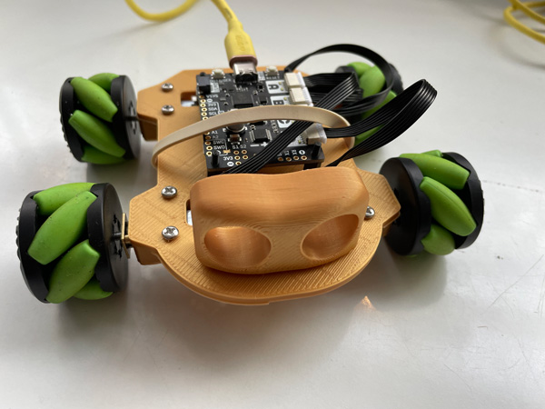

# MecanumRover Class


## Overview
The `MecanumRover` class provides an easy-to-use interface for controlling a mecanum wheel rover. The class simplifies movement and dance sequences by abstracting motor operations into reusable methods. It is designed for embedded systems, such as microcontrollers, with limited resources.

## Features
- Move forward, backward, strafe, spin, and diagonal directions.
- Easy configuration of speed scaling and directions.
- Predefined dance sequence.
- Efficient management of hardware resources.

---

## Installation
1. Clone the repository:
   ```bash
   git clone <repository_url>
   ```
2. Ensure you have the required hardware and libraries installed:
   - **Motor module**: `motor`, `motor2040`
   - **Pimoroni library**: `REVERSED_DIR`

3. Upload the script to your microcontroller.

---

## Usage
### Importing and Initializing the Class
```python
from mecanum_rover import MecanumRover

# Initialize the rover
rover = MecanumRover(speed_scale=10.0)
```

### Controlling the Rover
- **Move Forward**:
  ```python
  rover.move_forward(speed=3.0, duration=2)
  ```
- **Move Backward**:
  ```python
  rover.move_backward(speed=3.0, duration=2)
  ```
- **Strafe Left**:
  ```python
  rover.strafe_left(speed=3.0, duration=2)
  ```
- **Strafe Right**:
  ```python
  rover.strafe_right(speed=3.0, duration=2)
  ```
- **Spin Clockwise**:
  ```python
  rover.spin_clockwise(speed=3.0, duration=2)
  ```
- **Spin Counterclockwise**:
  ```python
  rover.spin_counterclockwise(speed=3.0, duration=2)
  ```
- **Diagonal Left Forward**:
  ```python
  rover.diagonal_left_forward(speed=3.0, duration=2)
  ```
- **Diagonal Right Forward**:
  ```python
  rover.diagonal_right_forward(speed=3.0, duration=2)
  ```

### Running a Dance Sequence
```python
rover.dance_sequence(speed=3.0, duration=3)
```

### Stopping and Disabling Motors
- **Stop All Motors**:
  ```python
  rover.stop_all()
  ```
- **Disable All Motors**:
  ```python
  rover.disable_motors()
  ```

---

## Class Documentation
### `MecanumRover`
#### Constructor
```python
MecanumRover(speed_scale=10.0)
```
- **Parameters**:
  - `speed_scale` (float): Scaling factor for motor speed. Default is `10.0`.

#### Methods
1. **`enable_motors()`**
   - Enables all motors.

2. **`disable_motors()`**
   - Disables all motors.

3. **`stop_all()`**
   - Stops all motors.

4. **`move(speeds, duration)`**
   - Moves the rover based on the given motor speeds.
   - **Parameters**:
     - `speeds` (list): Speed values for motors `[A, B, C, D]`.
     - `duration` (float): Duration in seconds.

5. **Directional Methods**
   - `move_forward(speed, duration)`
   - `move_backward(speed, duration)`
   - `strafe_left(speed, duration)`
   - `strafe_right(speed, duration)`
   - `spin_clockwise(speed, duration)`
   - `spin_counterclockwise(speed, duration)`
   - `diagonal_left_forward(speed, duration)`
   - `diagonal_right_forward(speed, duration)`

6. **`dance_sequence(speed=3.0, duration=3)`**
   - Runs a predefined dance sequence.
   - **Parameters**:
     - `speed` (float): Speed of the movements.
     - `duration` (float): Duration of each movement in seconds.

---

## Example
```python
from mecanum_rover import MecanumRover

# Initialize the rover
rover = MecanumRover(speed_scale=10.0)

# Perform dance sequence
rover.dance_sequence(speed=3.0, duration=3)

# Stop and disable motors
rover.stop_all()
rover.disable_motors()
```

---

## Acknowledgment
This class is inspired by the rover design and control concepts detailed at [Kev's Robots](https://www.kevsrobots.com/blog/Rover-mecanum.html). The 3D printable files for the rover are also available on this website.

---

## Notes
- Ensure that your hardware is properly configured and powered.
- Use `gc.collect()` to free up resources if running on limited-memory devices.

---

## License
This project is licensed under the MIT License. See `LICENSE` for more details.

---

## Contributions
Feel free to submit issues or pull requests to improve this project. We welcome feedback and suggestions!
